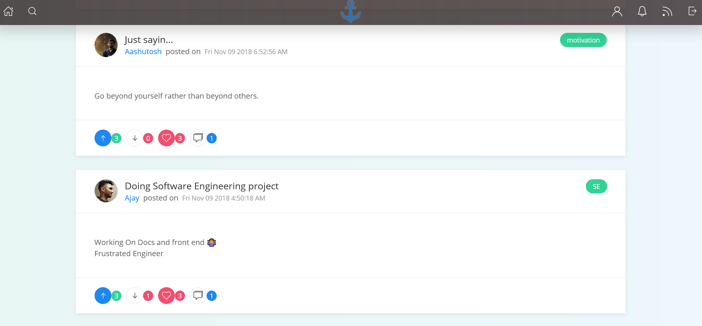
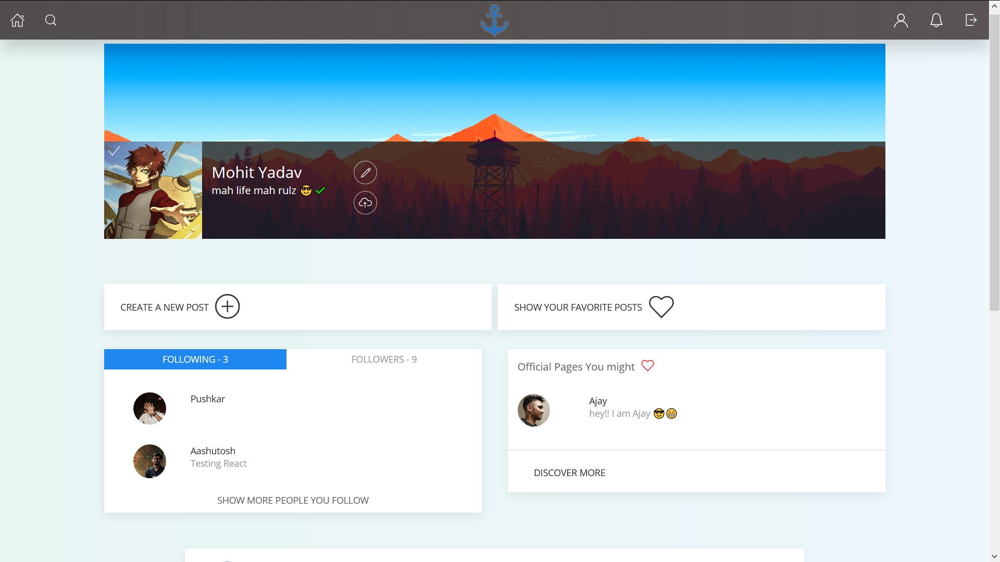

# cruzz-web
<p align='center'> </p>

<p align="center">


| Features      | Status        |
| ------------- |:-------------:|
| Sign Up      | :white_check_mark: |
| Login      | :white_check_mark: |
| Profile | :white_check_mark: |
| Follow/Unfollow a user | :white_check_mark: |
| Update user details | :white_check_mark: |
| Update profile picture/Cover | :white_check_mark: |
| Post(with or without tags) | :white_check_mark: |
| Search(with or without tags) | :white_check_mark: |
| Emoji inputs in post | :white_check_mark: |
| Allow html in post | :white_check_mark: |
| **Render raw html input from a post** | :white_check_mark: |
| Edit/Delete a post | :white_check_mark: |
| Upvote/Downvote a post | :white_check_mark: |
| Add/Remove a post to favourites | :white_check_mark: |
| View all post from favourites | :white_check_mark: |
| Edit/Delete a post | :white_check_mark: |
| Comment on a post | :white_check_mark: |
| Chat | :clock4: |
| Anonymous polls | :clock4: |


## Usage instructions
* signup with a @iiitvadodara.ac.in email
* Make sure https://cruzz.herokuapp.com is live and working


## Demo
### Feed Page



### Profile Page



## Useful commands

### run
```
yarn start
```
```
yard build
```
```
yard test
```